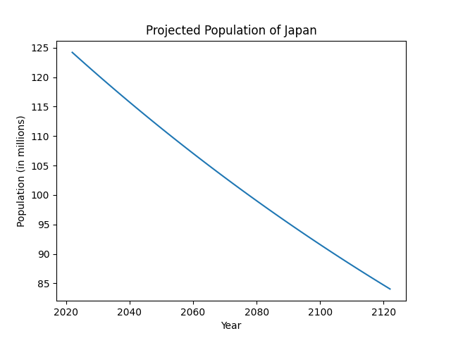
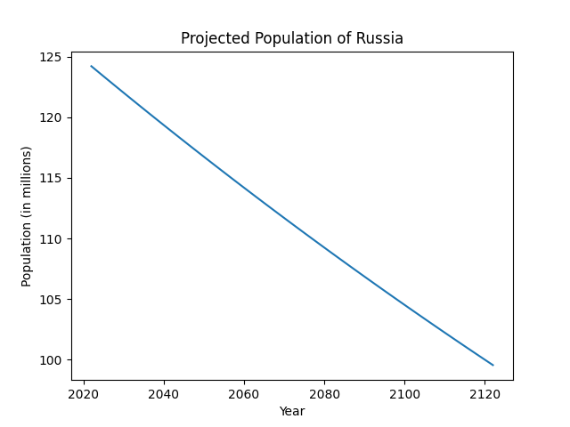

# CrudePopulationProjection
Provides a "middle-of-the-road" projection for any population, which holds that rates stay the same instead of increasing/decreasing
Formula: ```lastYearPop + (((birthRate - deathRate) * (lastYearPop / 1000)) + (netMigration * (lastYearPop / 1000))))```

# Examples



# TODO (?)
- Scrape CIA World Factbook instead of having rate manually entered?
- Improve model?

# Use
- Install python and matplotlip
- Download file
- Edit global variables
- Run and enjoy graph :)

*Created during math class instead of paying attention to teacher*
